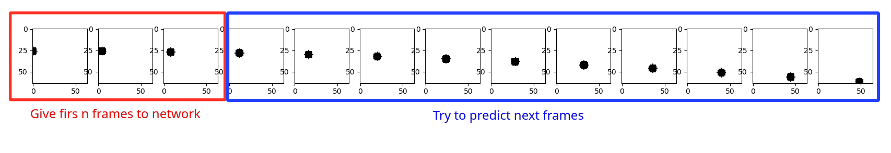
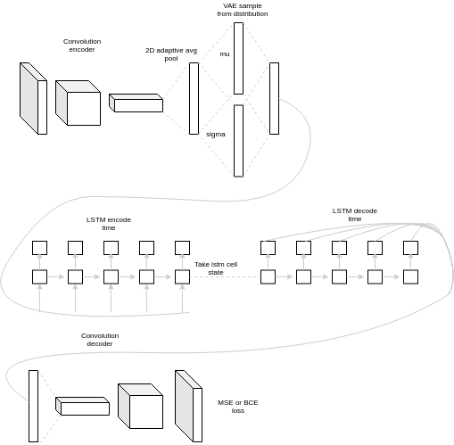
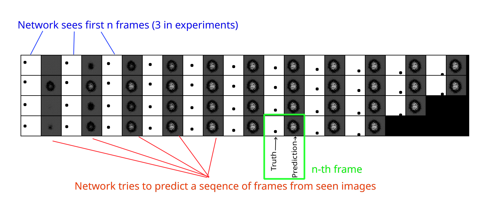

# frame-predict
This project idea is to try predict next n frames, by seeing only first few frames (3 in example)
I took UNet and removed skip connections, I used this architecture only to create encoder and decoder model.

Between encoder and decoder I am using LSTM which acts as an time encoder. 
Time encoder goal is to encoder information about the frames it has seen so it can predict them later. 
LSTM's here are used simialr to seq2seq models.

Because sequence lenghts are variational, they are all stacked in a batch, im using indicies to later
split them apart and pick only the ones I need after using packed LSTM sequences to calculate loss.

## Dataset is sequence of falling dot

## Architecure design

# Results:
How to interpret the results: 

## Vanilla autoencoder
- Batch size 32
- lr 0.001
- z_vector size 16
- beta 1

## Vanilla autoencoder z_vector size 2
- Batch size 32
- lr 0.001
- z_vector size 2
- beta 1

## VAE autoencoder
- Batch size 32
- lr 0.001
- z_vector size 16
- beta 1

## Beta VAE autoencoder
- Batch size 32
- lr 0.001
- z_vector size 3
- beta 150

